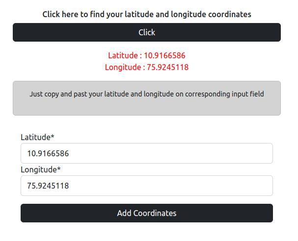
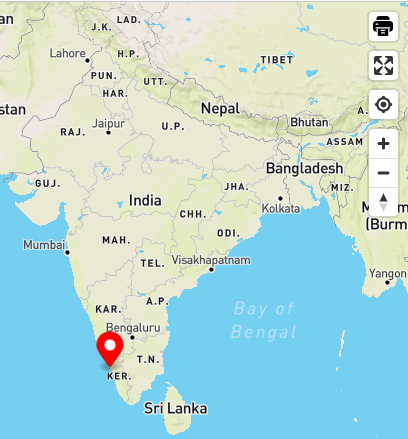

# Mandtracker 🌍

Mandtracker is a simple Webapp to find the location of people using latitude and longitude coordinates.

<br>

<p>Hosted in Heroku </p>

- [Mandtracker](https://mandtracker.herokuapp.com/)


## Tech Used
- Mapbox API

<br>

## Snapshots

<br>

### User View

<hr>

<br>
     
### Admin View

<hr>

<br>



<br>

## Setup

The first thing to do is to clone the repository:

  

```sh

$ https://github.com/adhilameenet/SHN-mapbox-API

$ cd SHN-mapbox-API

```

Create a . env file in the project directory and set the mongodb connection string

```sh

DB_NAME =
DB_CONNECTION_STRING = 

```  

Then install the dependencies:

  

```sh

npm install

```


Then run the server using

```sh

$ npm start

```

And navigate to `http://127.0.0.1:3000/`

<br>

## Contributors
- [Adhil Ameen](https://github.com/adhilameenet)
- [Hadi Bin Noor](https://github.com/hadui)
- [Faheem](https://github.com/FaheemMundodan)

